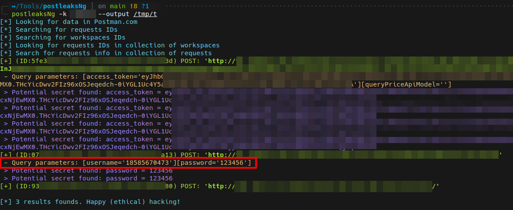

# postleaksNg

## Description

[Postman](https://www.postman.com/home) is an awesome platform to build and use APIs, used by millions developers.  
It proposes also public API assets built by them which can contains custom endpoints and data. Unfortunately, these items can leak sensitive data about private websites and companies.  
This script is aimed to search for these pieces of information in Postman public library.

## Installation

```bash
pip3 install postleaksNg
```

or 

```bash
pip3 install .
```

## Usage

```bash
❯ postleaksNg -h
usage: postleaksNg [-h] -k KEYWORD [--include INCLUDE] [--exclude EXCLUDE] [--raw] [--output OUTPUT]

postleaksNg 🚀💧 Search for sensitive data in Postman public library.

options:
  -h, --help           show this help message and exit
  -k KEYWORD           Keyword (Domain, company, etc.)
  --include INCLUDE    URL should match this string
  --exclude EXCLUDE    URL should not match this string
  --raw                Display raw filtered results as JSON
  --output OUTPUT      Store JSON in specific output folder (Default: results_<TIMESTAMP>)
```

*The results are available in `results_<TIMESTAMP>` subfolder. The filename is the request identifier in Postman.com*

## Example



## Notes

Secret detection is done with [whispers](https://github.com/adeptex/whispers). Rules are stored in `config.yml` file.
